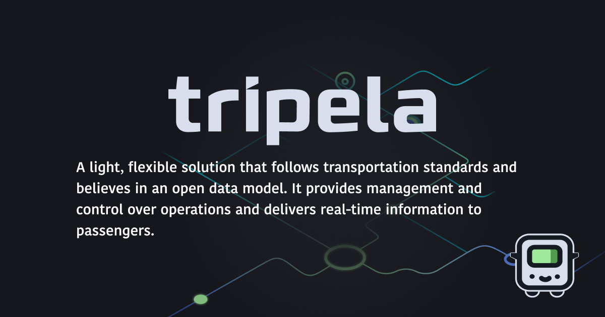

#### Tripela is a light, flexible automatic vehicle location (AVL) system.

It is designed to support the most common standards used in public transportation:

- GTFS,
- NeTEx,
- TransXChange,
- ITxPT.

The solution was designed to be suitable for Bus Open Data Service (BODS) compliance, as well.

### Who Is Tripela For?

Tripela offers several advantages to different stake holders in public transportation.

- **Public Transportation Authorities:**

  - PTAs can gain better understanding about the performance of transport services.
  - Information coming from an AVL, such as Tripela can be useful during the planning and policy making of public transportation.
  - AVL capabilities can become useful in case of emergencies when real-time information is critical.
  - Data coming from AVLs can be used to provide better communication with passengers.

- **Public Transportation Operators:**
  - PTOs can monitor their fleet in real time, allowing immediate adjustments to routes or schedules based on traffic conditions or vehicle issues.
  - Drivers can get real-time information about traffic conditions and alternate routes, helping them navigate more effectively.
  - Operators can inform passengers better about arrival times and digital displays.

### Features

Behind the benefits listed above there are multiple features that Tripela provides.

- **User and Vehicle Identity:** Tripela is ideal to use with smart phones of both the drivers and fixed devices on-board the vehicles.
- **Android and iOS Support**
- **Timetable Data:** Timetables can be viewed in timetable view, or the stops and the route are projected on the map.
- **Location Data:** Location data is at the core of Tripela. It's used to calculate expected arrival times.
- **Standardized Color Scheme:** Green indicates on-time arrivals, while early is shown as red, and late arrivals appear with a yellow tone.

### Demo

### Who We Are

The application is developed by a team of software developers specialized in transportation. We're passionate about seeking problems in public transportation that can be solved with technology. We came up with the idea of Tripela to offer an accessible AVL solution to PTAs and PTOs.

### Contact Us

- You can find out more about the project at [tripela.net](tripela.net)
- Give our blog a look at [blog.tripela.net](blog.tripela.net)
- If you'd like to learn more about Tripela, reach out to us at [holapp[at]tripela.net](mailto:hola@tripela.net)
